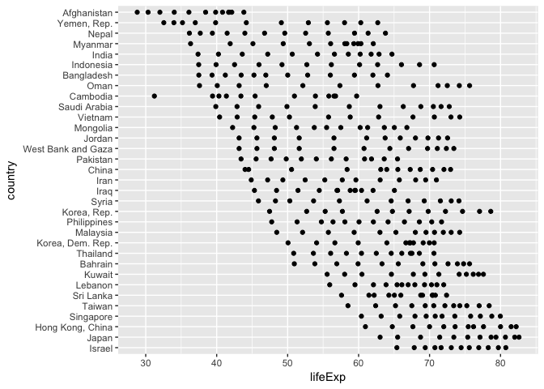
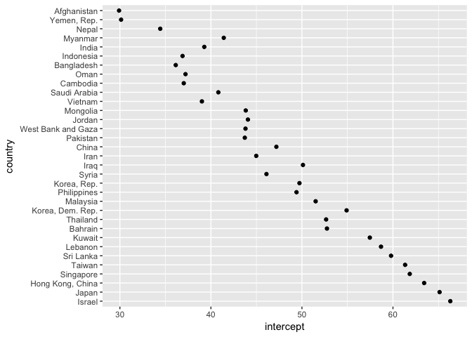
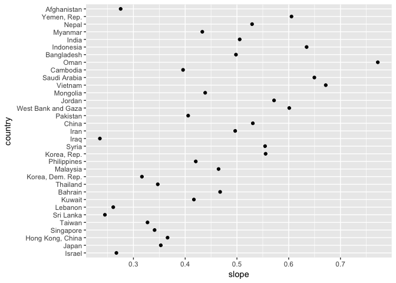
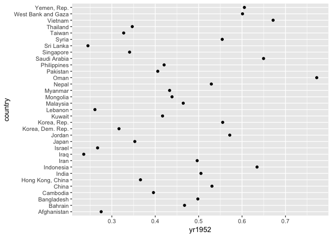
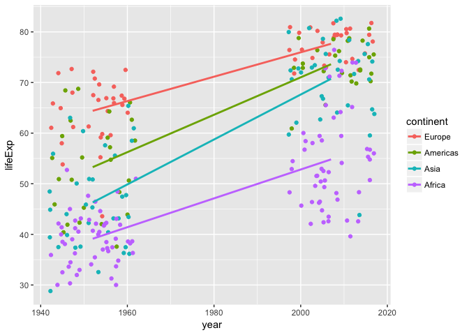
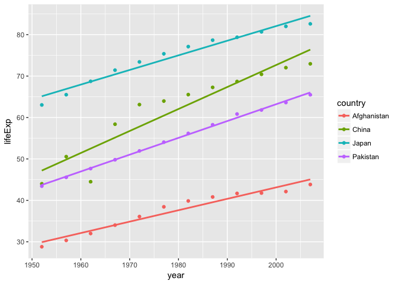
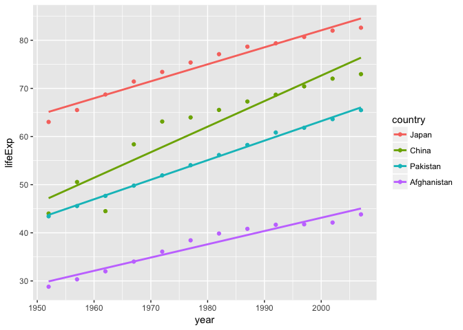

Why nesting is worth the awkwardness
================
Jenny Bryan
2018-04-02

``` r
library(gapminder)
library(tidyverse)
```

gapminder data for Asia only

``` r
gap <- gapminder %>%
  filter(continent == "Asia") %>%
  mutate(yr1952 = year - 1952)

ggplot(gap, aes(x = lifeExp, y = country)) +
  geom_point()
```

<!-- -->

Random arrangement of countries

Set factor levels with intent. Imagine you want this to persist across
an entire analysis.

``` r
gap <- gap %>%
  mutate(country = fct_reorder2(country, x = -1 * year, y = lifeExp))

ggplot(gap, aes(x = lifeExp, y = country)) +
  geom_point()
```

<!-- -->

Much better\!

Now imagine we want to fit a model to each country and lot at dot plots
of slope and intercept.

Nested approach … leaves `country` as factor.

``` r
gap_nested <- gap %>%
  group_by(country) %>%
  nest()

gap_fitted <- gap_nested %>%
  mutate(fit = map(data, ~ lm(lifeExp ~ yr1952, data = .x)))

gap_fitted <- gap_fitted %>%
  mutate(
    intercept = map_dbl(fit, ~ coef(.x)[["(Intercept)"]]),
    slope = map_dbl(fit, ~ coef(.x)[["yr1952"]])
  )

ggplot(gap_fitted, aes(x = intercept, y = country)) +
  geom_point()
```

<!-- -->

``` r

ggplot(gap_fitted, aes(x = slope, y = country)) +
  geom_point()
```

<!-- -->

The `split()` + `lapply()` + `do.call(rbind, ...)` approach Much fussing

``` r
gap_split <- split(gap, gap$country)
gap_split_fits <- lapply(
  gap_split,
  function(df) {
    lm(lifeExp ~ yr1952, data = df)
  }
)
#> Error in lm.fit(x, y, offset = offset, singular.ok = singular.ok, ...): 0 (non-NA) cases
## oops ... the unused levels of country are a problem

gap_split <- split(droplevels(gap), droplevels(gap)$country)
gap_split_coefs <- lapply(
  gap_split,
  function(df) {
    coef(lm(lifeExp ~ yr1952, data = df))
  }
)
gap_split_coefs <- as.data.frame(do.call(rbind, gap_split_coefs))
gap_split_coefs$country <- rownames(gap_split_coefs)
str(gap_split_coefs)
#> 'data.frame':    33 obs. of  3 variables:
#>  $ (Intercept): num  66.3 65.1 63.4 61.8 61.3 ...
#>  $ yr1952     : num  0.267 0.353 0.366 0.341 0.327 ...
#>  $ country    : chr  "Israel" "Japan" "Hong Kong, China" "Singapore" ...

ggplot(gap_split_coefs, aes(x = `(Intercept)`, y = country)) +
  geom_point()
```

<!-- -->

``` r

ggplot(gap_split_coefs, aes(x = yr1952, y = country)) +
  geom_point()
```

<!-- -->

We are back to the random order of countries.

``` r
gap <- gapminder %>%
  filter(year %in% c(1952, 2007), continent != "Oceania") %>%
  droplevels() %>%
  select(continent, year, lifeExp) %>%
  mutate(continent = fct_reorder2(continent, x = year, y = lifeExp)) %>%
  arrange(continent, year)
View(gap)

levels(gap$continent)
#> [1] "Europe"   "Americas" "Asia"     "Africa"

ggplot(gap, aes(x = year, y = lifeExp, color = continent)) +
  geom_jitter(width = 10) + geom_smooth(method = "lm", se = FALSE)
```

<!-- -->

``` r

gap_nested <- gap %>%
  group_by(continent) %>%
  nest()
gap_nested
#> # A tibble: 4 x 2
#>   continent data              
#>   <fct>     <list>            
#> 1 Europe    <tibble [60 × 2]> 
#> 2 Americas  <tibble [50 × 2]> 
#> 3 Asia      <tibble [66 × 2]> 
#> 4 Africa    <tibble [104 × 2]>

gap_nested$data[[1]]
#> # A tibble: 60 x 2
#>     year lifeExp
#>    <int>   <dbl>
#>  1  1952    55.2
#>  2  1952    66.8
#>  3  1952    68.0
#>  4  1952    53.8
#>  5  1952    59.6
#>  6  1952    61.2
#>  7  1952    66.9
#>  8  1952    70.8
#>  9  1952    66.6
#> 10  1952    67.4
#> # ... with 50 more rows
t.test(lifeExp ~ year, data = gap_nested$data[[1]])
#> 
#>  Welch Two Sample t-test
#> 
#> data:  lifeExp by year
#> t = -10.324, df = 41.143, p-value = 5.481e-13
#> alternative hypothesis: true difference in means is not equal to 0
#> 95 percent confidence interval:
#>  -15.82985 -10.65035
#> sample estimates:
#> mean in group 1952 mean in group 2007 
#>            64.4085            77.6486

gap_tested <- gap_nested %>%
  mutate(tt = map(data, ~ t.test(lifeExp ~ year, data = .x)))

gap_tested$tt[[1]]
#> 
#>  Welch Two Sample t-test
#> 
#> data:  lifeExp by year
#> t = -10.324, df = 41.143, p-value = 5.481e-13
#> alternative hypothesis: true difference in means is not equal to 0
#> 95 percent confidence interval:
#>  -15.82985 -10.65035
#> sample estimates:
#> mean in group 1952 mean in group 2007 
#>            64.4085            77.6486
gap_tested$tt[[1]][["statistic"]]
#>         t 
#> -10.32382

gap_tested <- gap_nested %>%
  mutate(tt = map(data, ~ t.test(lifeExp ~ year, data = .x)),
         tt = map_dbl(tt, "statistic"))
gap_tested
#> # A tibble: 4 x 3
#>   continent data                   tt
#>   <fct>     <list>              <dbl>
#> 1 Europe    <tibble [60 × 2]>  -10.3 
#> 2 Americas  <tibble [50 × 2]>   -9.84
#> 3 Asia      <tibble [66 × 2]>  -11.5 
#> 4 Africa    <tibble [104 × 2]> -10.3

gap_split <- split(gap, gap$continent)
gap_split_tested <- lapply(
  gap_split,
  function(df) t.test(lifeExp ~ year, data = df)
)
gap_split_tested <- lapply(gap_split_tested, `[[`, "statistic")


gap <- gapminder %>%
  mutate(country = fct_reorder2(country, x = year, y = lifeExp)) %>%
  arrange(country, year)
View(filter(gap, year == 2007))


gap <- gapminder %>%
  filter(country %in% c("Japan", "China", "Pakistan", "Afghanistan")) %>%
  droplevels()

ggplot(gap, aes(x = year, y = lifeExp, color = country)) +
  geom_point() +
  geom_smooth(method = "lm", se = FALSE)
```

<!-- -->

``` r


gap <- gapminder %>%
  filter(country %in% c("Japan", "China", "Pakistan", "Afghanistan")) %>%
  droplevels() %>%
  mutate(
    country = fct_reorder2(country, x = year, y = lifeExp),
    yr1952 = year - 1952
  )

ggplot(gap, aes(x = year, y = lifeExp, color = country)) +
  geom_point() +
  geom_smooth(method = "lm", se = FALSE)
```

<!-- -->

``` r

levels(gap$country)
#> [1] "Japan"       "China"       "Pakistan"    "Afghanistan"
```

Much better\! Now we do more analyses, that require split-apply-combine.

``` r
gap_nested <- gap %>%
  group_by(country) %>%
  nest()

gap_fitted <- gap_nested %>%
  mutate(fit = map(data, ~ lm(lifeExp ~ yr1952, data = .x)))

gap_fitted$fit[[1]]
#> 
#> Call:
#> lm(formula = lifeExp ~ yr1952, data = .x)
#> 
#> Coefficients:
#> (Intercept)       yr1952  
#>     29.9073       0.2753
```
