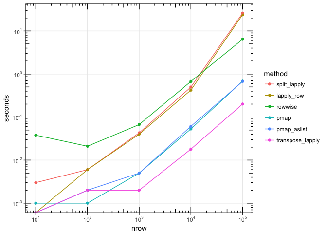

Making Winston's more suitable for general `f()`.

Load packages.


```r
library(tidyverse)
#> ── Attaching packages ───────────────────────────────────────── tidyverse 1.2.1 ──
#> ✔ ggplot2 2.2.1          ✔ purrr   0.2.4.9000
#> ✔ tibble  1.4.2          ✔ dplyr   0.7.4.9000
#> ✔ tidyr   0.8.0          ✔ stringr 1.3.0     
#> ✔ readr   1.1.1.9000     ✔ forcats 0.2.0
#> ── Conflicts ──────────────────────────────────────────── tidyverse_conflicts() ──
#> ✖ dplyr::filter() masks stats::filter()
#> ✖ dplyr::lag()    masks stats::lag()
library(scales)
#> 
#> Attaching package: 'scales'
#> The following object is masked from 'package:purrr':
#> 
#>     discard
#> The following object is masked from 'package:readr':
#> 
#>     col_factor
```


```r
# @drob
# split + lapply
f_split_lapply <- function(df, f) {
  df <- split(df, seq_len(nrow(df)))
  lapply(df, function(row) f(row))
}

# @winston_chang
# lapply over row indices
f_lapply_row <- function(df, f) {
  lapply(seq_len(nrow(df)), function(i) f(df[i , , drop = FALSE]))
}

# @krlmlr
# dplyr::rowwise
f_rowwise <- function(df, f) {
  df %>% rowwise() %>% do(row = f(.)) %>% pull(row)
}

# @JennyBryan
# purrr::pmap
f_pmap <- function(df, f) {
  pmap(df, lift_ld(f))
}

# purrr::pmap, but coerce df to a list first
f_pmap_aslist <- function(df, f) {
  pmap(as.list(df), lift_ld(f))
}

# @JennyBryan
# purrr::transpose then lapply
f_transpose_lapply <- function(df, f) {
  transpose(df) %>% lapply(f)
}
```

Benchmark each of them, using data sets with varying numbers of rows:


```r
run_benchmark <- function(nrow, f) {
  # Make some data
  df <- data.frame(
    x = rnorm(nrow),
    y = runif(nrow),
    z = runif(nrow)
  )
  
  res <- list(
    split_lapply     = system.time(f_split_lapply(df, f)),
    lapply_row       = system.time(f_lapply_row(df, f)),
    rowwise          = system.time(f_rowwise(df, f)),
    pmap             = system.time(f_pmap(df, f)),
    pmap_aslist      = system.time(f_pmap_aslist(df, f)),
    transpose_lapply = system.time(f_transpose_lapply(df, f))
  )
  
  # Get elapsed times
  res <- lapply(res, `[[`, "elapsed")

  # Add nrow to front
  res <- c(nrow = nrow, res)
  res
}

# Run the benchmarks for various size data
all_times <- lapply(1:5, function(n) {
  run_benchmark(10^n, f = as.list)
})

# Convert to data frame
times <- lapply(all_times, as.data.frame)
times <- do.call(rbind, times)

knitr::kable(times)
```


  nrow   split_lapply   lapply_row   rowwise    pmap   pmap_aslist   transpose_lapply
------  -------------  -----------  --------  ------  ------------  -----------------
 1e+01          0.003        0.000     0.038   0.001         0.000              0.000
 1e+02          0.006        0.006     0.021   0.001         0.002              0.002
 1e+03          0.043        0.040     0.067   0.005         0.005              0.002
 1e+04          0.497        0.423     0.673   0.053         0.061              0.018
 1e+05         25.945       23.801     6.404   0.684         0.672              0.201

## Plot times

This plot shows the number of seconds needed to process n rows, for each method. Both the x and y use log scales, so each step along the x scale represents a 10x increase in number of rows, and each step along the y scale represents a 10x increase in time.


```r
# Convert to long format
times_long <- gather(times, method, seconds, -nrow)

# Set order of methods, for plots
times_long$method <- fct_reorder2(
  times_long$method,
  x = times_long$nrow,
  y = times_long$seconds
)

# Plot with log-log axes
ggplot(times_long, aes(x = nrow, y = seconds, colour = method)) +
  geom_point() +
  geom_line() +
  annotation_logticks(sides = "trbl") +
  theme_bw() +
  scale_y_continuous(trans = log10_trans(),
    breaks = trans_breaks("log10", function(x) 10^x),
    labels = trans_format("log10", math_format(10^.x)),
    minor_breaks = NULL) +
  scale_x_continuous(trans = log10_trans(),
    breaks = trans_breaks("log10", function(x) 10^x),
    labels = trans_format("log10", math_format(10^.x)),
    minor_breaks = NULL)
#> Warning: Transformation introduced infinite values in continuous y-axis

#> Warning: Transformation introduced infinite values in continuous y-axis
```

<!-- -->
