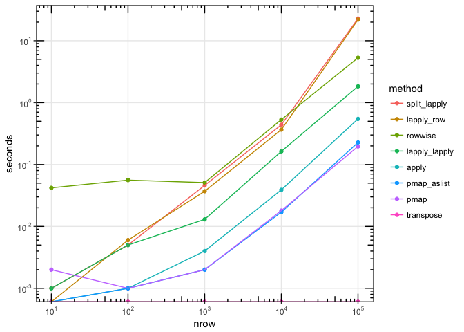

[Source](https://gist.github.com/wch/0e564def155d976c04dd28a876dc04b4) for this document.

@dattali [asked](https://twitter.com/daattali/status/761058049859518464), "what's a safe way to iterate over rows of a data frame?" The example was to convert each row into a list and return a list of lists, indexed first by column, then by row.

A number of people gave suggestions on Twitter, which I've collected here. I've benchmarked these methods with data of various sizes; scroll down to see a plot of times.


```r
library(purrr)
library(dplyr)
#> 
#> Attaching package: 'dplyr'
#> The following objects are masked from 'package:stats':
#> 
#>     filter, lag
#> The following objects are masked from 'package:base':
#> 
#>     intersect, setdiff, setequal, union
library(tidyr)
```


```r
# @dattali
# Using apply (only safe when all cols are same type)
f_apply <- function(df) {
  apply(df, 1, function(row) as.list(row))  
}

# @drob
# split + lapply
f_split_lapply <- function(df) {
  df <- split(df, seq_len(nrow(df)))
  lapply(df, function(row) as.list(row))
}

# @winston_chang
# lapply over row indices
f_lapply_row <- function(df) {
  lapply(seq_len(nrow(df)), function(i) as.list(df[i,,drop=FALSE]))
}

# @winston_chang
# lapply + lapply: Treat data frame as list, and the slice out lists
f_lapply_lapply <- function(df) {
  cols <- seq_len(length(df))
  names(cols) <- names(df)

  lapply(seq_len(nrow(df)), function(row) {
    lapply(cols, function(col) {
      df[[col]][[row]]
    })
  })
}

# @winston_chang
# purrr::by_row
# 2018-03-31 Jenny Bryan: by_row() no longer exists in purrr
# f_by_row <- function(df) {
#   res <- by_row(df, function(row) as.list(row))
#   res$.out
# }

# @JennyBryan
# purrr::pmap
f_pmap <- function(df) {
  pmap(df, list)
}

# purrr::pmap, but coerce df to a list first
f_pmap_aslist <- function(df) {
  pmap(as.list(df), list)
}

# @krlmlr
# dplyr::rowwise
f_rowwise <- function(df) {
  df %>% rowwise %>% do(row = as.list(.))
}

# @JennyBryan
# purrr::transpose (only works for this specific task, i.e. one sub-list per row)
f_transpose <- function(df) {
  transpose
}
```


Benchmark each of them, using data sets with varying numbers of rows:


```r
run_benchmark <- function(nrow) {
  # Make some data
  df <- data.frame(
    x = rnorm(nrow),
    y = runif(nrow),
    z = runif(nrow)
  )
  
  res <- list(
    apply         = system.time(f_apply(df)),
    split_lapply  = system.time(f_split_lapply(df)),
    lapply_row    = system.time(f_lapply_row(df)),
    lapply_lapply = system.time(f_lapply_lapply(df)),
    #by_row        = system.time(f_by_row(df)),
    pmap          = system.time(f_pmap(df)),
    pmap_aslist   = system.time(f_pmap_aslist(df)),
    rowwise       = system.time(f_rowwise(df)),
    transpose     = system.time(f_transpose(df))
  )
  
  # Get elapsed times
  res <- lapply(res, `[[`, "elapsed")

  # Add nrow to front
  res <- c(nrow = nrow, res)
  res
}

# Run the benchmarks for various size data
all_times <- lapply(1:5, function(n) {
  run_benchmark(10^n)
})

# Convert to data frame
times <- lapply(all_times, as.data.frame)
times <- do.call(rbind, times)

knitr::kable(times)
```


  nrow   apply   split_lapply   lapply_row   lapply_lapply    pmap   pmap_aslist   rowwise   transpose
------  ------  -------------  -----------  --------------  ------  ------------  --------  ----------
 1e+01   0.000          0.001        0.000           0.001   0.002         0.000     0.042           0
 1e+02   0.001          0.005        0.006           0.005   0.001         0.001     0.056           0
 1e+03   0.004          0.046        0.037           0.013   0.002         0.002     0.051           0
 1e+04   0.039          0.439        0.366           0.163   0.018         0.017     0.532           0
 1e+05   0.546         22.844       21.957           1.833   0.196         0.227     5.301           0


## Plot times

This plot shows the number of seconds needed to process n rows, for each method. Both the x and y use log scales, so each step along the x scale represents a 10x increase in number of rows, and each step along the y scale represents a 10x increase in time.


```r
library(ggplot2)
library(scales)
library(forcats)

# Convert to long format
times_long <- gather(times, method, seconds, -nrow)

# Set order of methods, for plots
times_long$method <- fct_reorder2(
  times_long$method,
  x = times_long$nrow,
  y = times_long$seconds
)

# Plot with log-log axes
ggplot(times_long, aes(x = nrow, y = seconds, colour = method)) +
  geom_point() +
  geom_line() +
  annotation_logticks(sides = "trbl") +
  theme_bw() +
  scale_y_continuous(trans = log10_trans(),
    breaks = trans_breaks("log10", function(x) 10^x),
    labels = trans_format("log10", math_format(10^.x)),
    minor_breaks = NULL) +
  scale_x_continuous(trans = log10_trans(),
    breaks = trans_breaks("log10", function(x) 10^x),
    labels = trans_format("log10", math_format(10^.x)),
    minor_breaks = NULL)
#> Warning: Transformation introduced infinite values in continuous y-axis

#> Warning: Transformation introduced infinite values in continuous y-axis
```

<!-- -->
